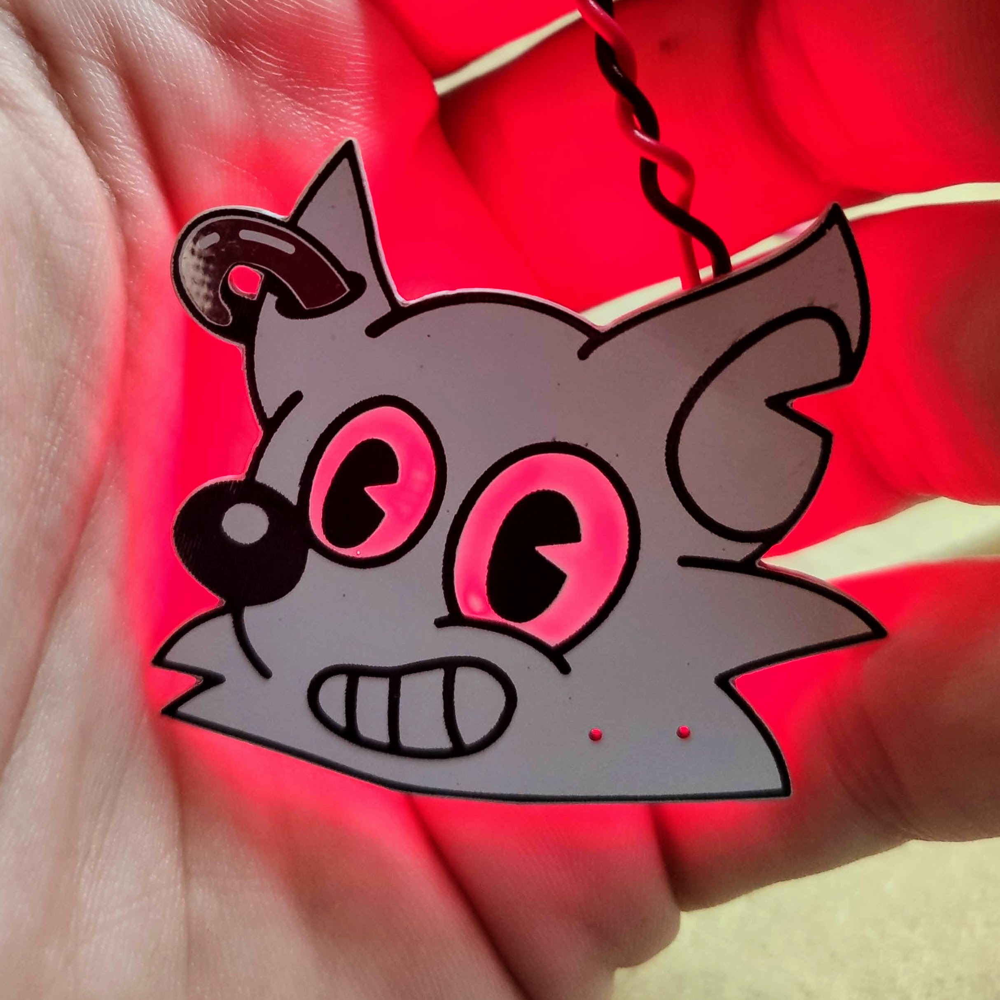
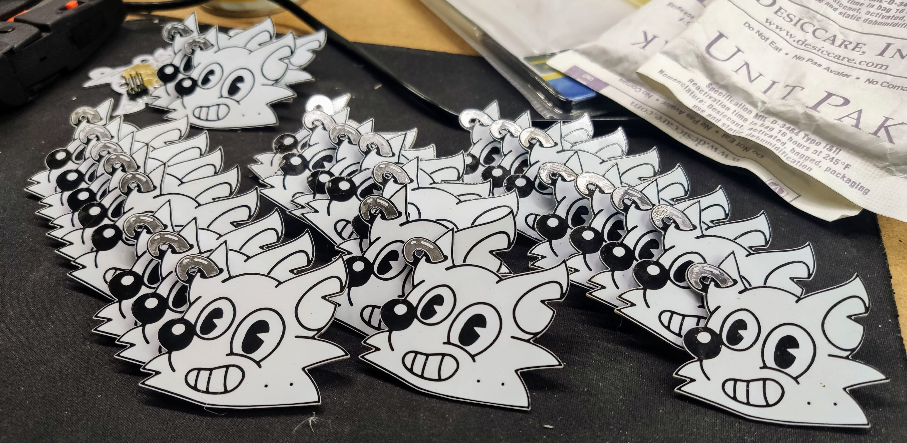
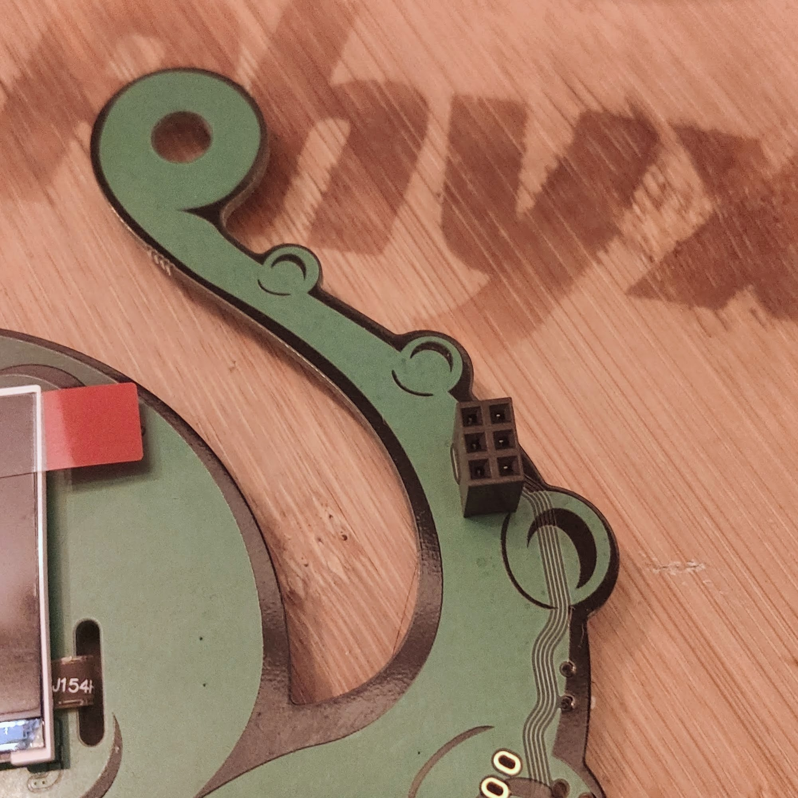
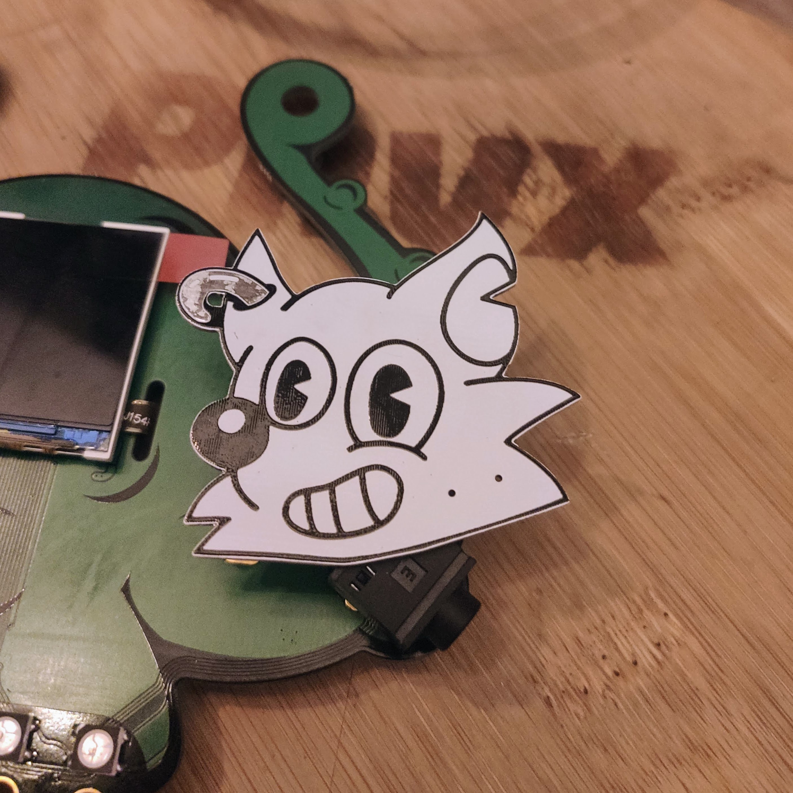
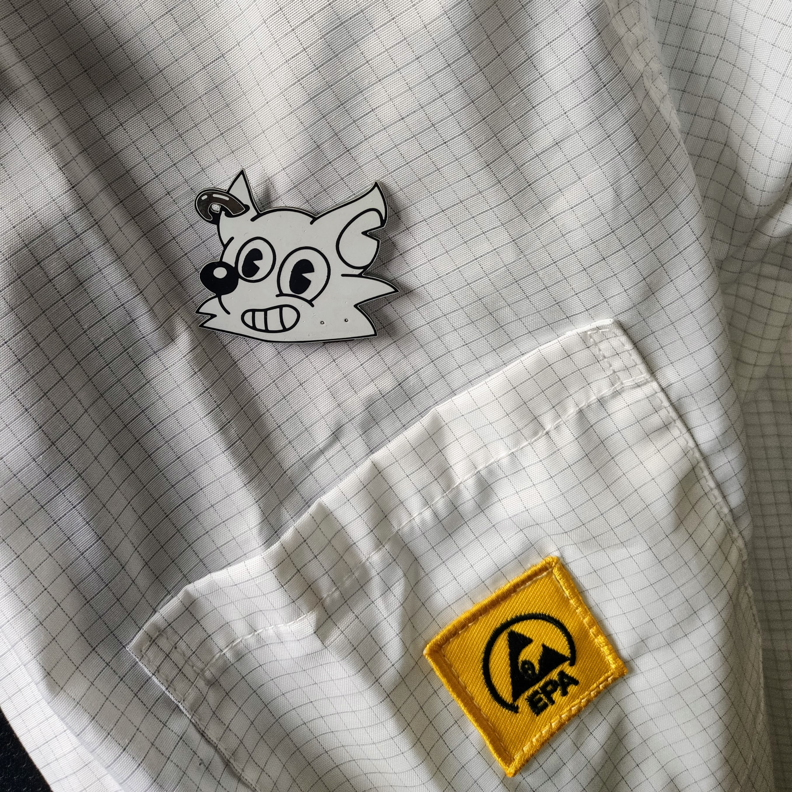

# Thank you Fri3d Camp 2022 volunteer!

This repository contains the hardware design of the [Fri3d Camp](https://fri3d.be/) mini fox head in rubber hose animation style which can also be found on some of the merch!
The graphical design has been made by [Toon Van de Putte](https://twitter.com/toonvandeputte/).

## The electronics

The boards are hand soldered by [Wim](https://twitter.com/brubacker/) from [Phyx](http://phyx.be/) and are available in different versions.
- **R** - the version with red LEDs mounted
- **G** - the version with green LEDs mounted
- **B** - the version with blue LEDs mounted
- **W** - the version with white LEDs mounted (warning, higher power drain!)
- **N** - the version with WS2812 LEDs aka NeoPixels mounted, might require extra cpode to run
- **S** - the standalone version with a Microchip [ATSAMD11C14](https://www.microchip.com/en-us/product/ATSAMD11C14) microcontroller and USB-C power input. This board can run Arduino code using the boatloader from [Mattairtech](https://github.com/mattairtech/ArduinoCore-samd).

## Using the non-standalon versions
The boards are [SAO V1.69BIS](https://hackaday.com/2019/03/20/introducing-the-shitty-add-on-v1-69bis-standard/) compatible and will fit other camp badges. For your convenience we've added a femala header which you can solder on the Fri3d badge.

Solder the header on the front of the badge.

Mount the PCB as shown in the picture above.

## Using the standalone version
The boards come pre-flashed with the most recent version of the [Mattairtech](https://github.com/mattairtech/ArduinoCore-samd) bootloader.
They come equiped with 4 Neopixels and a row of test pads that fit a regular size 0.1" pin header. By default it will run some light animations, but with some thinkering you could use the board as an USB macropad for example.
As an added bonus we've foreseen a pin mounting so you can wear the board on your clothes like a nametag.

